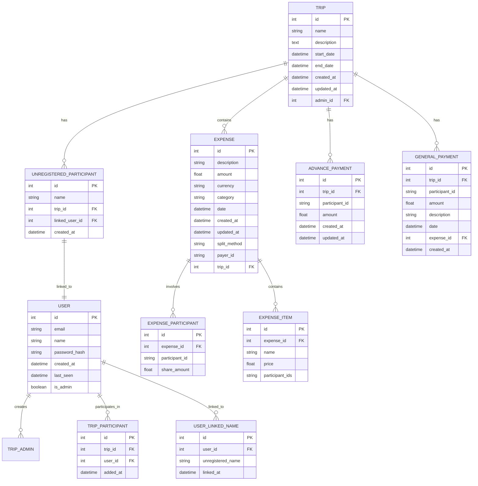

# Redesigned Expense Tracker Data Model

This document outlines the redesigned data model for the Expense Tracker application with improved structure and relationships.

## Overview

The redesigned data model focuses on:
1. Clear separation of concerns
2. Proper normalization
3. Better handling of unregistered participants
4. Improved relationships between entities
5. Enhanced data integrity

## Entity Relationship Diagram

## Detailed Entity Descriptions

### USER
Represents a registered user of the application.

**Attributes:**
- `id` (PK): Unique identifier
- `email`: User's email address (unique)
- `name`: User's full name
- `password_hash`: Hashed password
- `created_at`: Account creation timestamp
- `last_seen`: Last login timestamp
- `is_admin`: Admin privileges flag

### TRIP
Represents a trip/event where expenses are tracked.

**Attributes:**
- `id` (PK): Unique identifier
- `name`: Trip name
- `description`: Trip description
- `start_date`: Trip start date
- `end_date`: Trip end date
- `created_at`: Creation timestamp
- `updated_at`: Last update timestamp
- `admin_id` (FK): Reference to USER who created the trip

### TRIP_PARTICIPANT
Junction table for many-to-many relationship between TRIP and USER.

**Attributes:**
- `id` (PK): Unique identifier
- `trip_id` (FK): Reference to TRIP
- `user_id` (FK): Reference to USER
- `added_at`: Timestamp when user was added to trip

### EXPENSE
Represents an expense incurred during a trip.

**Attributes:**
- `id` (PK): Unique identifier
- `description`: Expense description
- `amount`: Expense amount
- `currency`: Currency code (default: INR)
- `category`: Expense category
- `date`: Date when expense was incurred
- `created_at`: Creation timestamp
- `updated_at`: Last update timestamp
- `split_method`: How the expense is split ('equal', 'exact', 'itemized')
- `payer_id`: ID of who paid (can be user ID or 'unregistered_name')
- `trip_id` (FK): Reference to TRIP

### UNREGISTERED_PARTICIPANT
Represents a participant who hasn't registered but is part of a trip.

**Attributes:**
- `id` (PK): Unique identifier
- `name`: Participant name
- `trip_id` (FK): Reference to TRIP
- `linked_user_id` (FK): Reference to USER if linked
- `created_at`: Creation timestamp

### ADVANCE_PAYMENT
Represents advance payments made by participants.

**Attributes:**
- `id` (PK): Unique identifier
- `trip_id` (FK): Reference to TRIP
- `participant_id`: ID of participant (user ID or 'unregistered_name')
- `amount`: Advance payment amount
- `created_at`: Creation timestamp
- `updated_at`: Last update timestamp

### GENERAL_PAYMENT
Represents general payments made during a trip.

**Attributes:**
- `id` (PK): Unique identifier
- `trip_id` (FK): Reference to TRIP
- `participant_id`: ID of participant (user ID or 'unregistered_name')
- `amount`: Payment amount
- `description`: Payment description
- `date`: Payment date
- `expense_id` (FK): Reference to related EXPENSE (optional)
- `created_at`: Creation timestamp

### EXPENSE_PARTICIPANT
Junction table for expense participants and their shares.

**Attributes:**
- `id` (PK): Unique identifier
- `expense_id` (FK): Reference to EXPENSE
- `participant_id`: ID of participant (user ID or 'unregistered_name')
- `share_amount`: Amount this participant owes for this expense

### EXPENSE_ITEM
Represents items within an itemized expense.

**Attributes:**
- `id` (PK): Unique identifier
- `expense_id` (FK): Reference to EXPENSE
- `name`: Item name
- `price`: Item price
- `participant_ids`: JSON array of participant IDs who consumed this item

### USER_LINKED_NAME
Tracks unregistered names linked to registered users.

**Attributes:**
- `id` (PK): Unique identifier
- `user_id` (FK): Reference to USER
- `unregistered_name`: Name of unregistered participant linked to user
- `linked_at`: Timestamp when linking occurred